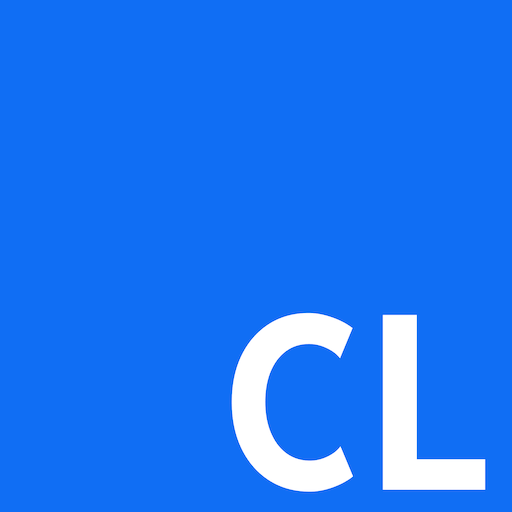

# CLLE language server

This extension adds language features for CL into the IDE, including:

* Outline view
* Content assist / completion provider
* Go to or peek definition and references
* Content assist and hover support for CL commands
   * requires connection to IBM i through Code for IBM i or Merlin IDE.

## Developers

### Developing and debugging

1. clone
2. `npm i`
3. 'Launch Client' through VS Code
4. After the extension is activated, use 'Attach to Server'

### Language tests

Our language tests are using vitest. The tests exist in `./language/vitest`

* `npm run lang:test`

### Creating a build

To create a `.vsix`, use the script provided:

* `run npm package`
